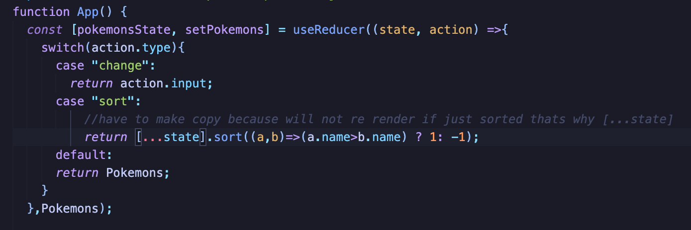
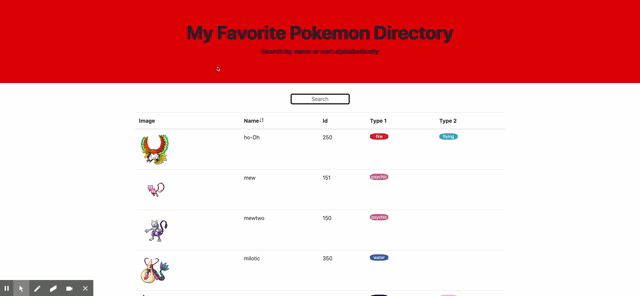

# pokemon-directory

## Description 

I made a directory using react to easily and quickly reference what type my favorite pokemon are. This application has a search bar and can also filter pokemon names alphabetically. React enables me only to be rendered the relevant information that I searched.

This application further helped me as a developer to become more familiar with react.  The code snippet shows how I utilized hooks and how I handled the search bar's input and sort the pokemon alphabetically. 

### Code Highlights

## Table of Contents
* [Installation](#installation)
* [Usage](#usage)
* [Credits](#credits)
* [License](#license)
   
## Installation

The installation of this project is to click on the green code button in the top right corner. Then you can copy and paste the code via ssh or by downloading a zip file. Once you have downloaded the file there are a couple of things that must be downloaded in order for this application to run properly. The first is node.js once this is downloaded open up the terminal and navigate to the file that this project is saved in. Then run the code:

                                                npm i 

This should download react. Then all that is left to do is run the command:

                                                npm start

in the termnal and then go to the browser and type in http://localhost:3000. 

## Usage 

The usage of this app enables the user to reference their favorite pokemon so that they can see the type and Pokedex number. The user can sort the pokemon alphabetically by pressing the button next to the table heading. Furthermore, the search bar dynamically updates what is rendered to the user. 
Below is a demonstration of the app, as well as the deployed link.

[pokemon directory](https://hondahelix.github.io/pokemon-directory/)

### App Demo

   
## Credits

Third party applications and instruction was provided by the University of California Berkeley' full stack Coding Bootcamp program as well as the utilization of node.js, react and sprites from PokeApi.  

[UCB Coding Bootcamp](https://bootcamp.berkeley.edu/coding/)   

[Node.js](https://https://nodejs.org/en/)   

[React](https://reactjs.org/) 

[PokemonApi](https://pokeapi.co/)

## License

 MIT

## Badges

## Contact

[My Github](https://github.com/hondahelix) 

[My portfolio](https://nameless-castle-45341.herokuapp.com)
